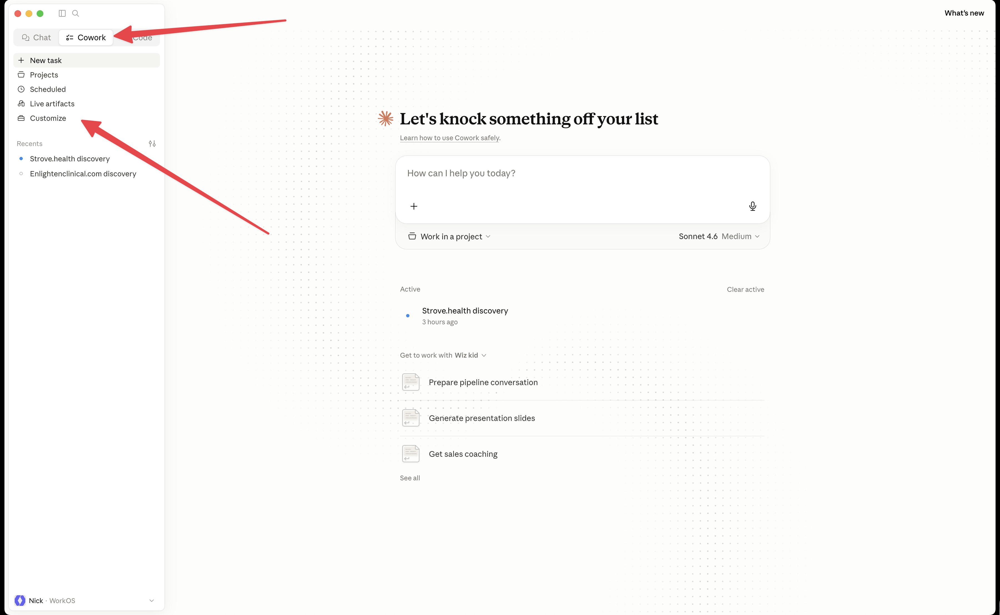
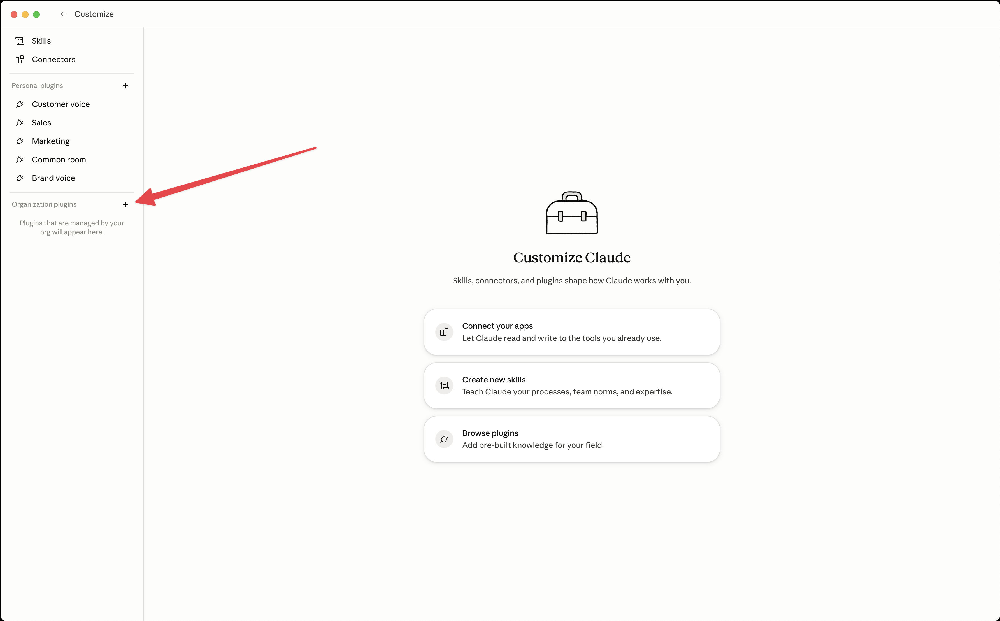
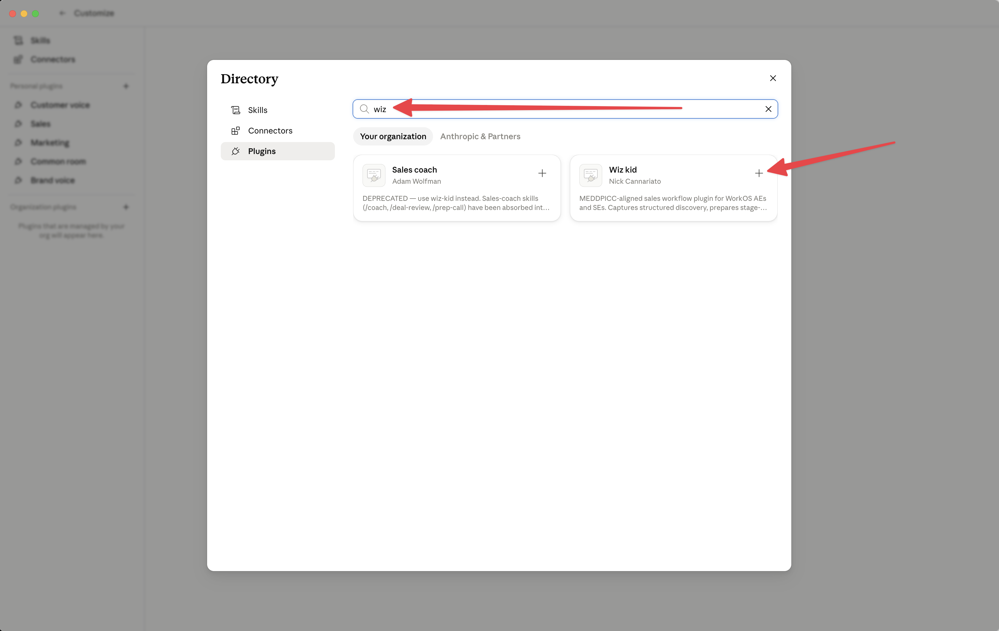
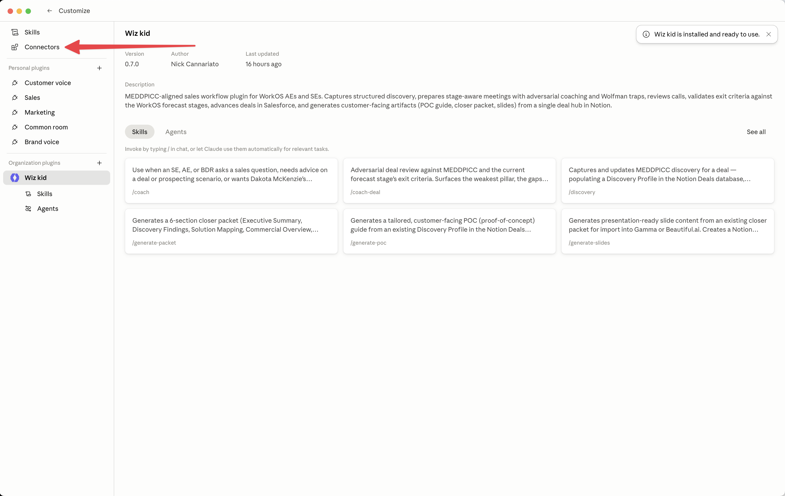
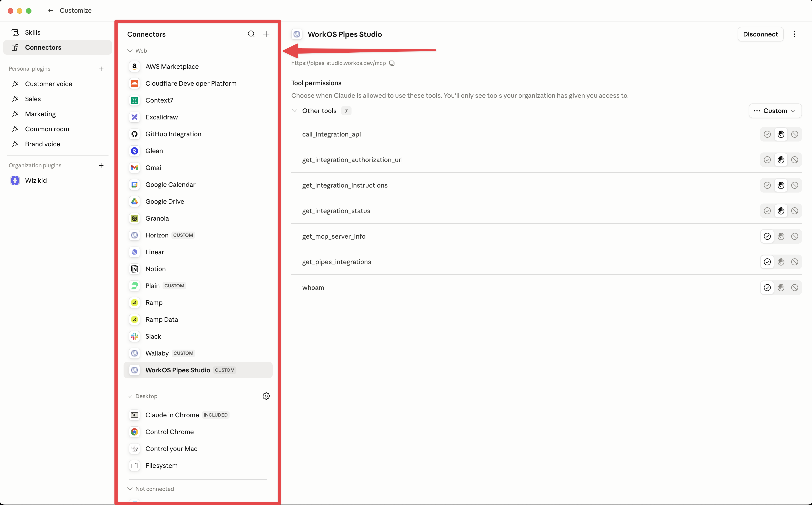

# Your Deal, On Wiz-Kid

Set it up once, then run <Highlight color="green">every stage</Highlight> with it.

<!--
This is an enablement session, not a feature tour. Goal: by the end, every AE/BDR
can run the workflow on a live deal tomorrow. Keep it concrete — we follow ONE deal
(Acme) the whole way through.
-->

---
layout: section
---

<SectionHeader icon="⏰">

# It's signature week

Acme said yes weeks ago. You've sent over the contract. The SE says the PoC went well and we got the technical win. And yet... silence.

</SectionHeader>

<!--
Set the tension. This is the In-Medias-Res open. Put them in the worst version of
this moment — the one every rep has lived.
-->

---

## Do you actually <Highlight color="green">know</Highlight> if it closes?

<AnimatedList animation="fade-up">

- Has the *economic buyer* actually said the words?
- Is there a blocker nobody surfaced three weeks ago?
- Did your champion ever get tested — or are they just friendly?

</AnimatedList>

<!--
These are the questions that kill forecasts in the last mile. The whole point of
wiz-kid is that by signature week you ALREADY know the answers — because you've been
running one loop the entire deal. Pivot here: "Here's the loop."
-->

---

## 10 skills. <Highlight color="green">One loop.</Highlight>

wiz-kid ships a bunch of commands.

But you're not going to remember ten commands, so you're not going to memorize ten commands. You're going to learn <RoughMark type="underline" color="green">one loop</RoughMark> and run it at every stage of the deal.

<!--
This is the thesis of the whole talk (the Spiral's "simple version" setup). Don't list
the 12 commands yet — that's the trap that makes the tool feel heavy. Promise the loop.
-->

---
layout: section
---

<SectionHeader icon="🛠️">

# Getting Set Up

Do this. **Now**.

</SectionHeader>

<!--
TODO section. Keep install fast — this is the part people stall on, so make it feel
trivial. Workshop beat: have everyone run these two commands now if they haven't.
-->

---
layout: section
---

<SectionHeader icon="🧩">

# Install it in Claude Desktop

From Cowork, in three clicks — no terminal required.

</SectionHeader>

<!--
Sub-section divider. Workshop beat: have everyone follow along on their own machine.
This is the Cowork → Customize path. Three clicks and it's installed.
-->

---
layout: default
geometry: false
---

## Open <Highlight color="green">Customize</Highlight> in Cowork

<!--
Step 1. Top-left: switch from Chat to Cowork. Then bottom-left in the sidebar: Customize.
This is where skills, connectors, and plugins all live.
-->

---
layout: default
geometry: false
---

## Add an <Highlight color="green">organization plugin</Highlight>

<!--
Step 2. wiz-kid is managed by your org, so it lives under "Organization plugins."
Hit the + to browse the directory.
-->

---
layout: default
geometry: false
---

## Search & install <Highlight color="green">Wiz Kid</Highlight>

<!--
Step 3. Search "wiz" — install the one by Nick Cannariato, NOT the deprecated
"Sales coach". Click the +. That's the whole install.
-->

---
layout: section
---

<SectionHeader icon="🔌">

# Connect your stack

wiz-kid reads from the tools you already live in.

</SectionHeader>

<!--
Sub-section divider. Connectors are what make discovery, review, and prep rich.
Notion matters most — it's the deal hub. Everything else degrades gracefully.
-->

---
layout: default
geometry: false
---

## Open <Highlight color="green">Connectors</Highlight>

<!--
"Wiz kid is installed and ready to use." Now wire up the tools — open Connectors
from the left sidebar.
-->

---
layout: default
geometry: false
---

## Connect <Highlight color="green">'em all</Highlight>

<!--
Connect what you've got. Notion = the deal hub (most important). Wallaby = live SF
reads. Granola/Gong = transcripts. Missing one? It still runs and falls back to
markdown — don't block on perfect tooling.
-->

---
layout: section
---

<SectionHeader icon="🔁">

# The Loop

Every gate is the same four moves.

</SectionHeader>

<!--
Spiral — Pass 1, the simple version. This is the mental model the whole talk hangs on.
Keep it clean: five moves, no caveats yet.
-->

---

## The four moves

<AnimatedList animation="fade-up">

- 🔎 **Discover** — `/discovery` enriches what you know
- 🎯 **Prepare** — `/prepare-{stage}` plans the gate conversation
- 📝 **Review** — `/review-call` captures what actually changed
- ✅ **Advance** — `/update-stage` moves it in Salesforce*

</AnimatedList>

<!--
Walk the circle once, slowly. This is Discover → Prepare → (have the call) → Review →
Coach → Advance. We'll callback to this exact slide at the end. Don't explain the
sub-mechanics yet — just the shape.
-->

---

## The loop never <Highlight color="green">resets</Highlight>

`/review-call` feeds straight back into `/discovery`.

<Callout type="tip" title="Discovery is the spine">
Every call, every orbit pours back into the same Discovery Profile. It only ever gets <RoughMark type="underline" color="green">richer</RoughMark> — wiz-kid never overwrites what you've confirmed.
</Callout>

<!--
This is the load-bearing idea, and it's why this is a Spiral and not a checklist.
Each turn around the loop you know more than the last. The profile compounds. Land
this hard — it's what makes the five moves a spiral instead of a to-do list.
-->

---

## Meet the deal: <Highlight color="green">Acme</Highlight>

A domain just landed in your inbox: `acme.com`.

Brand new. You know nothing yet.

<!--
Story spine begins. From here, every command we show runs against acme.com so the
audience sees one continuous deal, not disconnected features.
-->

---
layout: section
---

<SectionHeader icon="🛰️">

# One Orbit

Acme, from cold domain to Pipeline.

</SectionHeader>

<!--
Spiral — Pass 2: run the loop for real, once, with the actual commands and the actual
Notion outputs. This is the demo-heavy core. Each slide = one move.
-->

---

## 🔎 Discover

<TerminalDemo :steps="[
  { cmd: '/discovery acme.com', output: 'Researched Web · Glean · Slack · Granola · LinkedIn in parallel' },
]" title="wiz-kid" prompt="> " />

<Callout type="tip" title="Lands in Notion">
A **Discovery Profile** — MEDDPICC captured field-by-field, every value sourced and confidence-rated. Re-run it anytime; it adds, never clobbers.
</Callout>

· [Example: Discovery doc](https://app.notion.com/p/workos/Discovery-Profile-372d458aea8b8128872ce18e877fde5f)

<!--
This is move 1. Point out: motion (Enterprise vs Pay-go) is auto-detected here. The
profile is the single source of truth every other command reads from.
-->

---

## 🎯 Prepare

<TerminalDemo :steps="[
  { cmd: '/prepare-pipeline acme.com', output: 'Built meeting prep: gap table, attendee profiles, talking points, traps' },
]" title="wiz-kid" prompt="> " />

<Callout type="tip" title="Lands in Notion">
A dated **Meeting Prep** page: MEDDPICC gap table, per-attendee profiles (LinkedIn-verified), Dakota talking points, key questions, and 2–4 Wolfman traps.
</Callout>

· [Example: Call Prep](https://app.notion.com/p/workos/Meeting-Prep-2026-06-01-372d458aea8b81a5ad36e9e9ac029ab8)

<!--
Move 2. The prepare command is stage-specific (prepare-pipeline for the first gate).
Everything in it is generated from the Discovery Profile. This is what you read in the
car before the call.
-->

---

## You have the call

Then you come back and tell wiz-kid how it went.

<!--
Breathing-room slide. The human does the human part. wiz-kid doesn't replace the
conversation — it makes sure you walk in prepared and walk out with the deal captured.
-->

---

## 📝 Review

<TerminalDemo :steps="[
  { cmd: '/review-call acme.com', output: 'Pulled transcript · extracted MEDDPICC updates · flagged 2 gaps' },
]" title="wiz-kid" prompt="> " />

<Callout type="info" title="Closes the loop">
Pulls the Granola/Gong transcript, writes a dated **Call Review**, and folds every update back into the Discovery Profile. *This is the feedback arrow.*
</Callout>

· [Example: Call Review](https://app.notion.com/p/workos/Call-Review-2026-06-01-372d458aea8b817790face362ec96f24)

<!--
Move 3 — and the spiral's hinge. Surfaces what advanced, what stayed stuck, and what
you MISSED. The MEDDPICC updates flow straight back into discovery, so the next orbit
starts richer.
-->

---

## ✅ Advance

<TerminalDemo :steps="[
  { cmd: '/update-stage acme.com', output: 'Validated Pipeline exit criteria · advanced to Developing in SF' },
]" title="wiz-kid" prompt="> " />

<Callout type="info" title="Gated, not vibes">
It won't advance until every exit criterion is *documented* in the profile. Writes a **Stage Audit** to Notion and the checklist to the SF opportunity.
</Callout>

<!--
Move 5. The key word is "documented." No hand-waving your way to the next stage. This
is also what makes pipeline reviews honest — the audit trail is right there.
-->

---

## That's one orbit

Acme went from a cold domain to a <Highlight color="green">qualified Pipeline deal</Highlight> — and the profile knows everything you learned.

<!--
Recap beat. Five moves, one stage advanced, profile enriched. Now the reveal: you do
this same thing at every gate. Transition into Pass 3.
-->

---
layout: section
---

<SectionHeader icon="📈">

# Same Loop, Higher Stakes

Now do it again. And again.

</SectionHeader>

<!--
Spiral — Pass 3, the nuanced version. Zoom out from one orbit to the full deal. Same
five moves, escalating gates. This is where the depth lives.
-->

---
layout: two-col
---

## Only one move renames itself

`/prepare-{stage}` changes per gate. The other four moves never change.

::left::

**Enterprise**

- Pipeline → `prepare-pipeline`
- Developing → `prepare-developing`
- Advancing → `prepare-advancing`
- Commit → `prepare-commit`
- Closed Won

::right::

**Pay-go**

- Discovery
- Pipeline
- POC
- Pricing Review
- Closed Won

<!--
wiz-kid auto-detects the motion from the hub and adapts the talking points, questions,
and traps. Same skill names work for both. The point: the LOOP is invariant — only the
prepare step knows which gate you're walking into.
-->

---

## What the gates actually check

Every exit criterion maps to one of eight pillars — <Highlight color="green">MEDDPICC</Highlight>:

**M**etrics · **E**conomic Buyer · **D**ecision Criteria · **D**ecision Process · **P**aper Process · **I**dentify Pain · **C**hampion · **C**ompetition

<Callout type="info" title="Why it matters to you">
`/discovery`, `/prepare-*`, `/review-call`, and `/update-stage` score against these. A "weak pillar" is just a gate criterion you haven't earned yet.
</Callout>

<!--
Don't teach MEDDPICC from scratch — most AEs know it. The point is that wiz-kid maps
its fields 1:1 to forecast-stage exit criteria, so "advance the deal" becomes
"fill the gaps in these pillars."
-->

---

## Wolfman traps

The questions that actually move a pillar:

<AnimatedList animation="fade-up">

- Get the pain in the customer's **own words**, with attribution
- Surface the **paper process** before contract time
- **Test** whether someone is a champion or just friendly
- Corner the **competition** on dimensions you win

</AnimatedList>

<!--
Every prepare-* and coach-deal generates 2-4 of these, tailored to the deal's specific
gaps. They're high-leverage, not manipulative. This is the "what do I actually SAY on
the call" payoff.
-->

---

## Discovery is <Highlight color="green">load-bearing</Highlight>

Four orbits in, the profile knows more than any single rep could hold in their head.

<AnimatedList animation="fade-up">

- Every `/discovery` run **adds** — never overwrites confirmed facts
- Every `/review-call` pours the call back in
- Confidence on each field climbs as sources stack up

</AnimatedList>

<Callout type="tip" title="This is the compounding part">
The deal that's hard to forecast is the one nobody wrote down. wiz-kid writes it down — every orbit, automatically.
</Callout>

<!--
This is the slide that earns the "Spiral" framing and answers the core question from
the open. Stress: the profile is cumulative and sourced. Pipeline review, handoffs, and
"wait, what did we learn in March?" all get easy.
-->

---

## Off the loop, on demand

Look for updates here later 👀:

<AnimatedList animation="slide-right">

- `/generate-packet`: A killer closer packer, using everything you've discovered mapped to everything they need
- `/generate-slides`: A slide deck, built from the closer packet

</AnimatedList>

<!--
These aren't part of the per-stage loop — they're tools you reach for. /coach for a
hallway question. generate-* once you have enough profile to package the deal for execs
or the customer's eng team. Mention generate-slides feeds Gamma/Beautiful.ai.
-->

---
layout: section
---

<SectionHeader icon="🎯">

# It was four moves the whole time

</SectionHeader>

<!--
Spiral — The Return. Bring it all the way back to slide "The five moves." The audience's
understanding has changed even though the loop hasn't.
-->

---

## The same four moves

<AnimatedList animation="none">

- 🔎 **Discover** — and it keeps getting richer
- 🎯 **Prepare** — for whichever gate you're at
- 📝 **Review** — and feed it back in
- ✅ **Advance** — when you've earned it

</AnimatedList>

<!--
Deliberate callback to the earlier slide, same list, annotations changed. This is the
"you knew this 20 minutes ago, but now you know what it means" moment.
-->

---

## Which move do I reach for?

<KeyPoints :points="[
  'At a stage gate? Run the loop: discover, prepare, review, coach, advance.',
  'Stuck mid-call or in the hallway? /coach.',
  'Ready to package for execs or the customer? /generate-poc and /generate-packet.',
]" title="Your cheat sheet" />

<!--
Give them the decision frame to take home. The loop is the default; the rest are
situational. This is the slide to screenshot and pin in Slack.
-->

---

## Back to signature week

It's the last mile with Acme again.

This time you <Highlight color="green">know</Highlight> — the EB said the words, the blockers have owners, the champion was tested. Because you ran the loop every step.

<!--
Close the In-Medias-Res frame from the open. Same moment, opposite feeling. The
forecast is real because the work was captured, orbit by orbit.
-->

---
layout: end
---

# Run the loop

Install wiz-kid, then `/discovery` your next deal.

[wiz-kid · claude-plugins-internal](https://github.com/workos/claude-plugins-internal)

<!--
Call to action. Concrete next step: pick a live deal and run /discovery on it today.
Offer to pair with anyone who wants to set it up after the session.
-->
